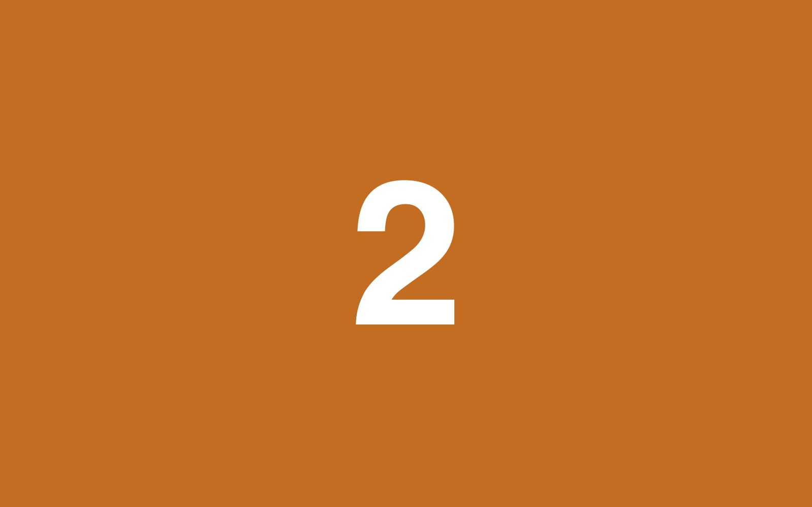
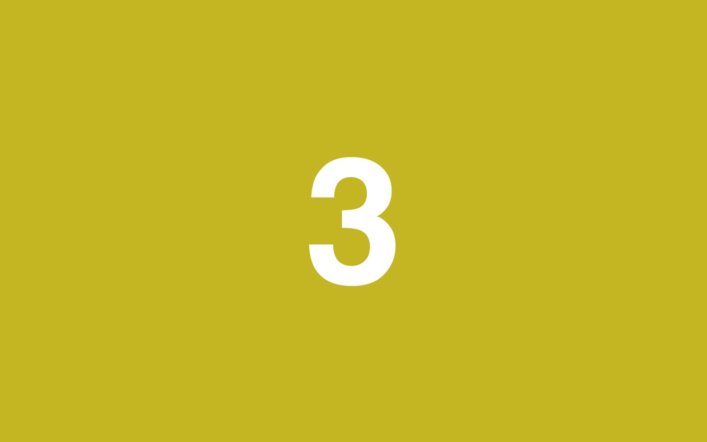
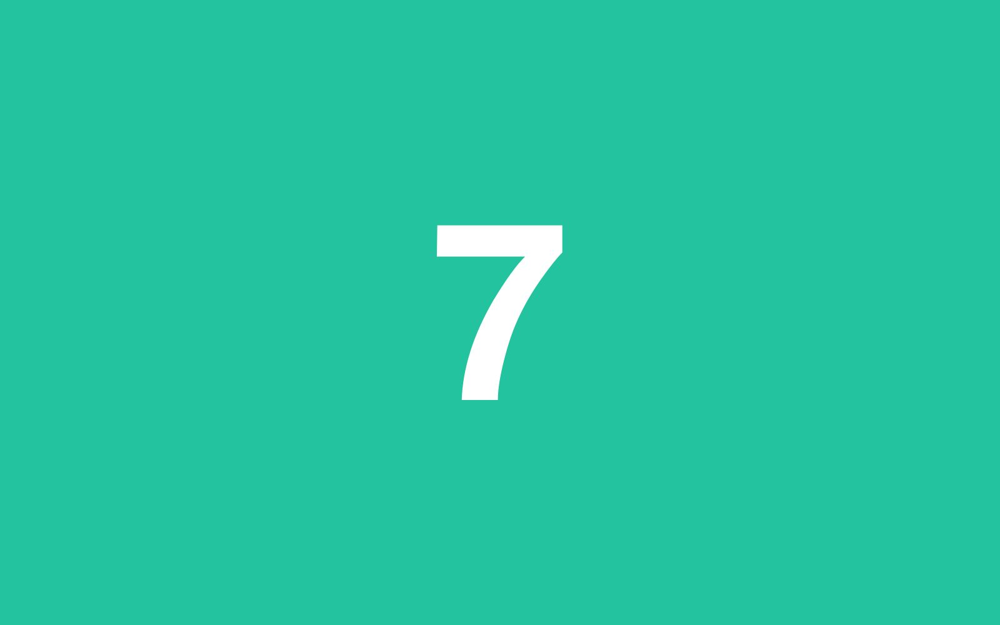
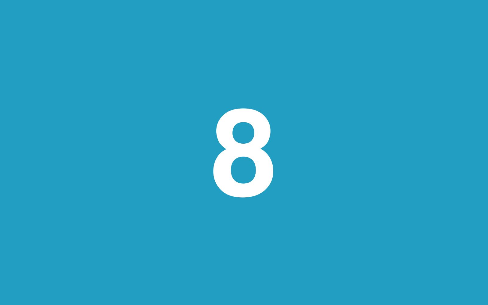
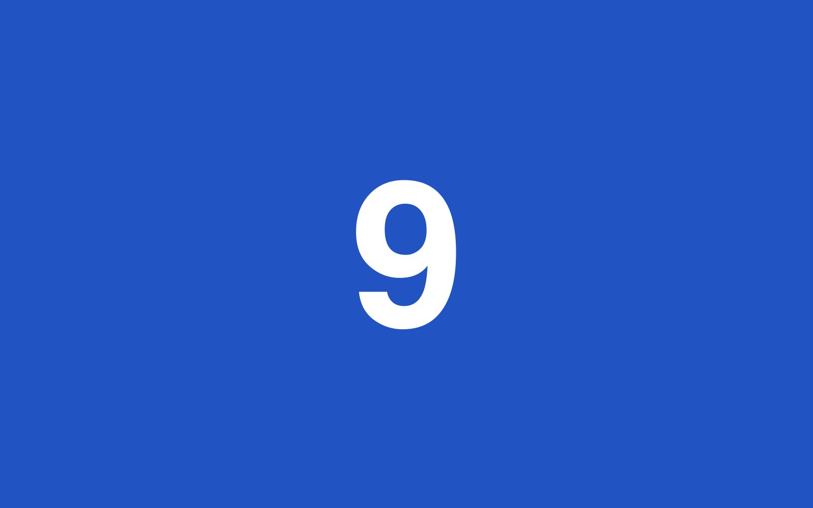
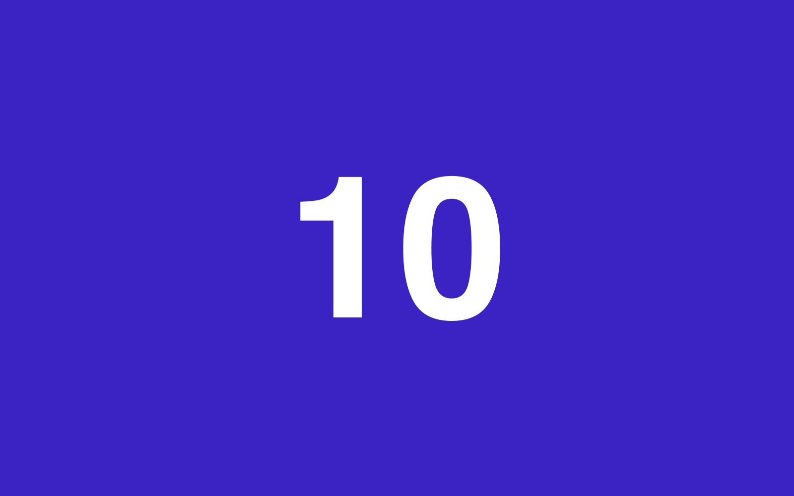
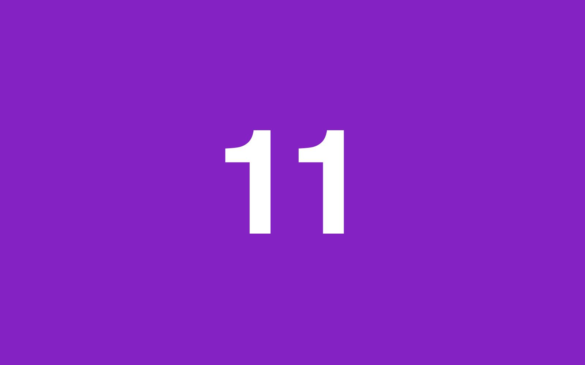
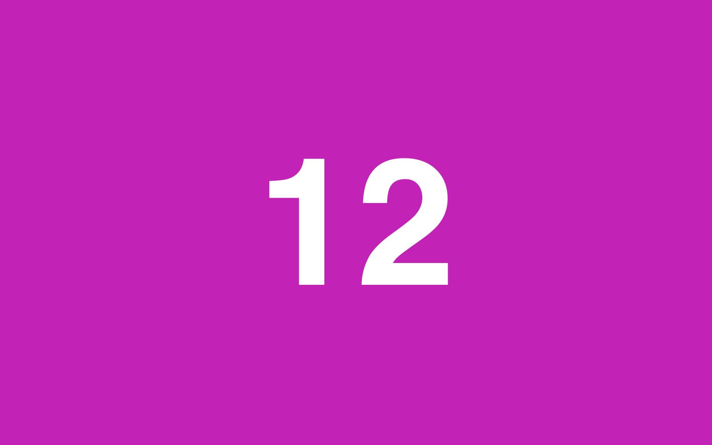
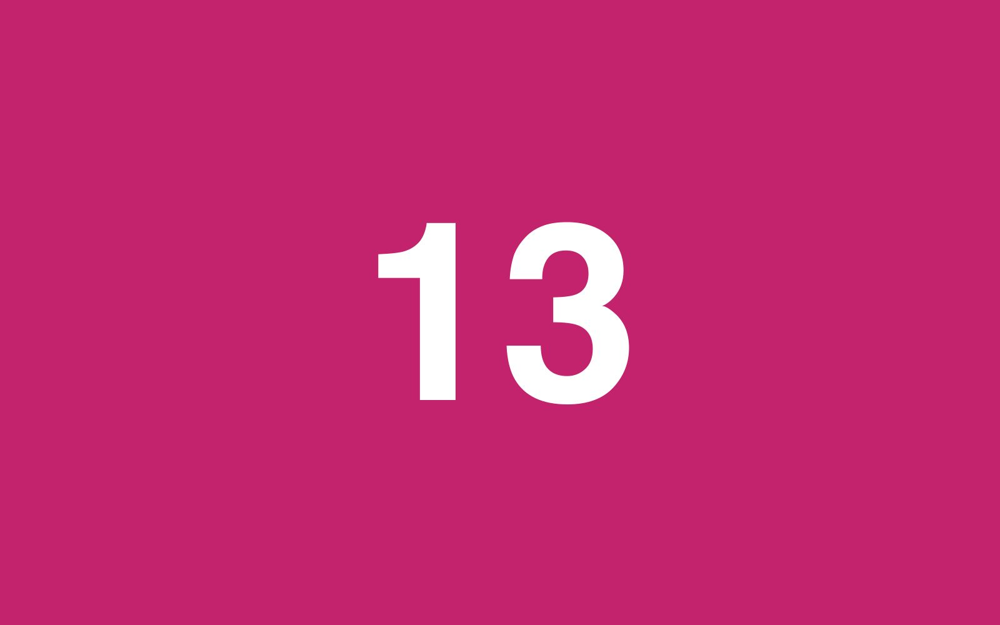

A lone image above; an adjacent pair below.

Some prose between the galleries to break the run.

More prose before the blank-line-separated triple.

And finally a blank-line-separated group of five.

