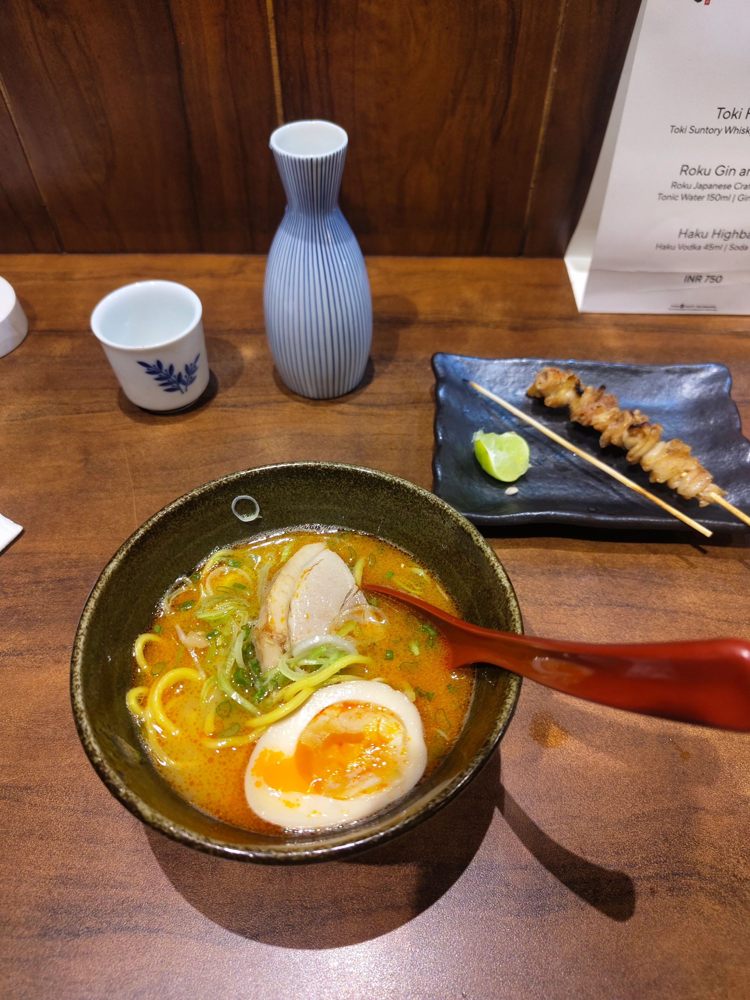
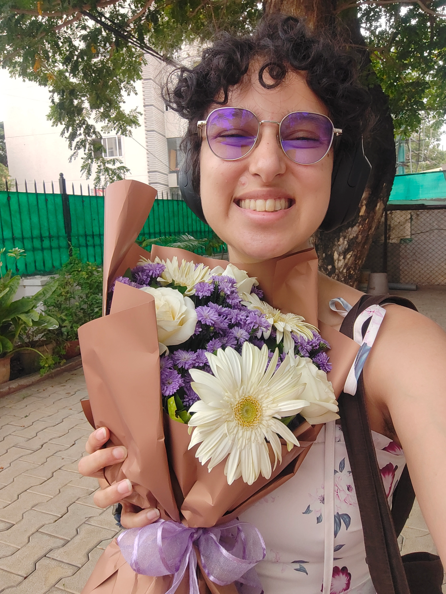

I used to have a complicated relationship with my birthday. I have spent the better part of my adulthood pretending it didn't exist. Because I used to hate being alive, I didn't want to celebrate that I was still here. I also didn't understand the social games people played with gifts, and expectations they had around their own birthdays and parties. If I didn't acknowledge mine, surely I could opt out of the concept entirely?

A good friend changed some of this a few years ago by demanding care in the form of acknowledging and celebrating their birthday, and expecting (good) gifts. Because I loved them, I obliged. Now I am in a much healthier place with my own.

## What I did this year

My birthday fell on a Sunday! And the Saturday was a [gfgf](https://girlfriendgirlfriend.com/about) - so I took myself out to a good party, dressing up, looking hot, and knowing that I can show myself a good time. I went alone (didn't have the energy to make plans with friends) but immediately met 12 people i know (bangalore queer circles are MUCH bigger than they were in 2016, but they're still small enough! What can I say) and really just _danced_. Bodies feel so good when they do what you want.

I woke up on Sunday with a mild hangover and a craving for ramen, so I took myself to [Kuuraku](https://maps.app.goo.gl/enovdBEq5DWTWcrg9), did some shopping after, and came back home just in time for some dearest friends to trickle into a small hang [Shru](https://www.shrutisunderraman.com/) had very kindly decided to make happen at my place. We hung out, then I changed into my pajamas and went to bed at 10pm. Fantastic day, couldn't have asked for more.

How did this happen?

1. **I am finally able to be alone and take joy in my own company**. I don't how to tell you how to make that happen. Maybe a decade of therapy? Somehow, when I am by myself now, I am a 29-year-old adult with a full and fascinating life, not a 5-year-old girl left to entertain herself for hours and days and weeks on end. **I am not afraid to be by myself**. I can take care of myself not just physically but also spiritually, emotionally. For the first time in my life, over the last year I have repeatedly chosen spending time with myself over (excellent!) company, and had a good time.
2. **I have proof that people exist and they love me**. This isn't a birthday thing - it is a feeling that follows me every day, throughout the year. Birthdays in popular culture are made out to be this big production where the day is supposed to be all about you/a way for people to show you who they are to you. But that is fake! (and also capitalism). So I've learnt to slowly let go of the expectation of a big thing, and look at what I _do_ have and revel in that. I also did get several messages wishing me and the reminder felt good :)
3. **Knowing that I didn't have to stress about plans for the day but was still going to meet friends was incredibly freeing.** I am so, so grateful to Shru for making this happen. I was initially excited about throwing a big party, but I spent the whole week before (and the week after) my birthday dealing with a really intense conflict and I was not in the space to plan or engage with other people. But she created group, set up snacks and punch, and coordinated people. My home is always set up for having guests so nothing else needed to be done. Doing emotional and intellectual labour for me is always its own gift, and this one was so lovely!

I'm looking forward to the next several decades of birthdays!
