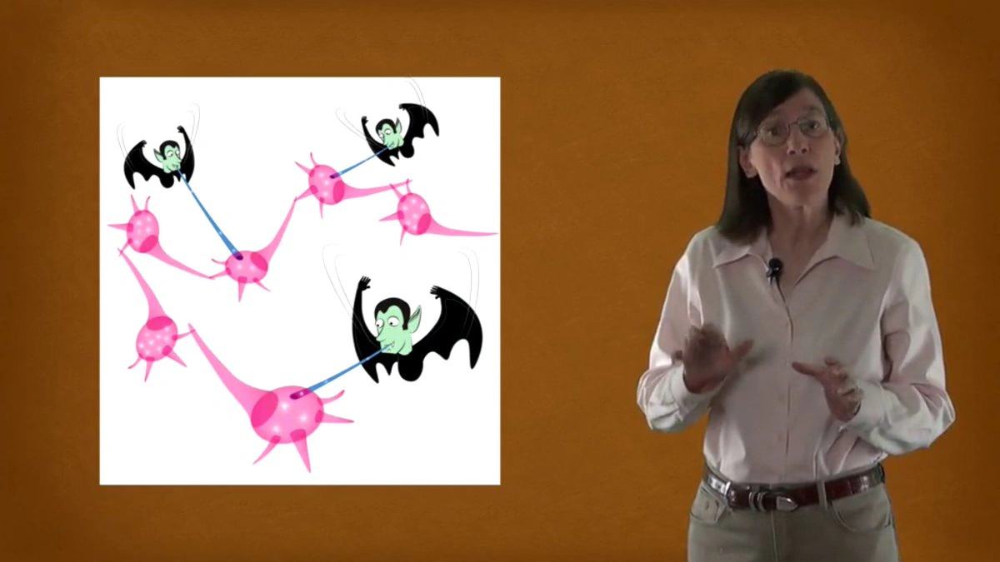

Long term memory occupies the rest of our brain, and can hold millions and millions of items. The transaction is made into the long term brain by a technique called 'spaced out repetition'

(Otherwise synapse vampires suck the brain connections away!)

