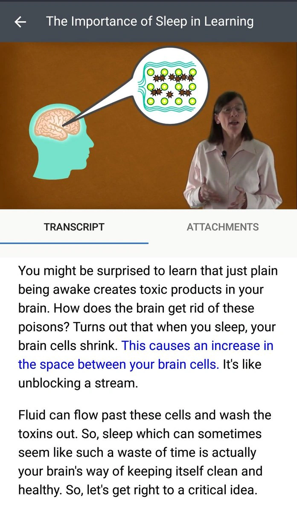

But I have a commute ahead of me, so here we go again.

So when we're awake we're constantly producing toxins that litter are brain. And when we sleep? Our brain is literally cleaning house. How it does that is pretty neat, see image.

