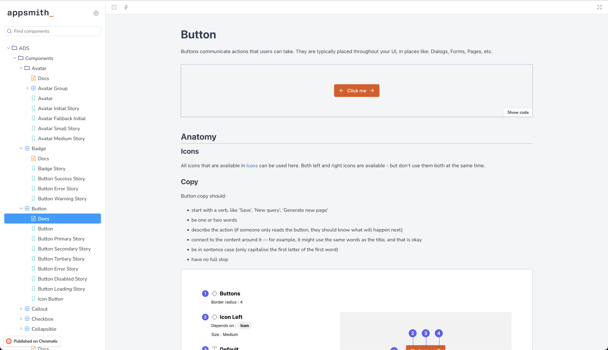

# Work

I contract regularly and am always open to discussing work!
I am based out of Bangalore, India. I am flexible with my schedule and can be available on US/EU timelines as needed.

In the past, I have worked on

- building design systems
- architecting data-heavy front ends
- design engineering

Apart from this, I would _like_ to work on

- engineering management
- building graph-based UIs
- data visualisation
- building a WebRTC product
- your problem here?

Here is an (inexhaustive) list of work I have done over the last few years.

## Math and Pencil

[Math and Pencil](https://www.mathandpencil.com/) builds technology to streamline operations in the medical and property insurance space. I was part of a team that built a medical compliance product that would provide middle managers at BigCorp with a single admin interface that simplifies case intake, FMLA verification, and other workflow stages.

- I designed a system that allowed anyone in the business unit with the necessary information to instantiate a form by feeding it a JSON schema. This significantly freed up engineering load and allowed faster prototyping from non-core engineers.
- I architected the client interface to handle local and offline data reliably to prevent data loss.
- I built out all the form and complex UI components necessary.
- I integrated OAuth with the app.

## Appsmith

[Appsmith](https://www.appsmith.com/) is an open-source low-code platform for tech power users to quickly build internal tools. In order to unify several competing UX patterns around the app, increase polish, and pay down tech debt, a design system was necessary.

- We built the [appsmith design system](https://github.com/appsmithorg/design-system/) to be complete, [accessible, well-tested, and correctly themed](https://design-system.appsmith.com/?path=/docs/ads-components-avatar--docs).
- We refactored ~50k loc to use this system across all parts of the codebase, and upon release received no p0 or p1 bugs. This project was derisked by a set of smaller initiatives:
  - We carried out a similar effort in a smaller scope earlier in the process.
  - I fixed existing typescript errors.
  - I enforced stricter linter checks across the engineering organisation.
- I set up processes to streamline hand-off between design\<\>dev using the design system components on Figma.
- I wrote documentation and some tests for the design system.

## Sprinto

[Sprinto](https://sprinto.com/) helps fast-growing cloud companies acquire security compliances (such as SOC2, ISO, GDPR, etc) by providing continuous monitoring and a centralized management dashboard.

- I built a proof-of-concept around creating a design system on top of [ant.design](https://4x.ant.design/components/overview/).
- I set up clear guidelines for the shape of components, created a composable layout system for them, and refactored several existing components to be more generic and fit with the guidelines.
- I set up a component storybook, and also a component UI testing workflow.

## Obvious/Wikipedia

[Obvious](https://www.obvious.in/) was an award-winning product strategy and design agency that partnered with startups, unicorns, industry titans and non-profits to create digital experiences their customers love. I was their first intern, and I later did my first full-time role with them.

As part of the web team, we worked with the New Readers Team at Wikipedia to help them [understand how to reach the next billion users](https://www.obvious.in/wikipedia).

- I wrote a script to scrape about thirty articles from Wikipedia across three different languages.
- We built a mobile-first application with several unique UI components - eg: stories, interactive quizzes.
- We ensured a seamless localised experience for Punjabi and Hindi users.
